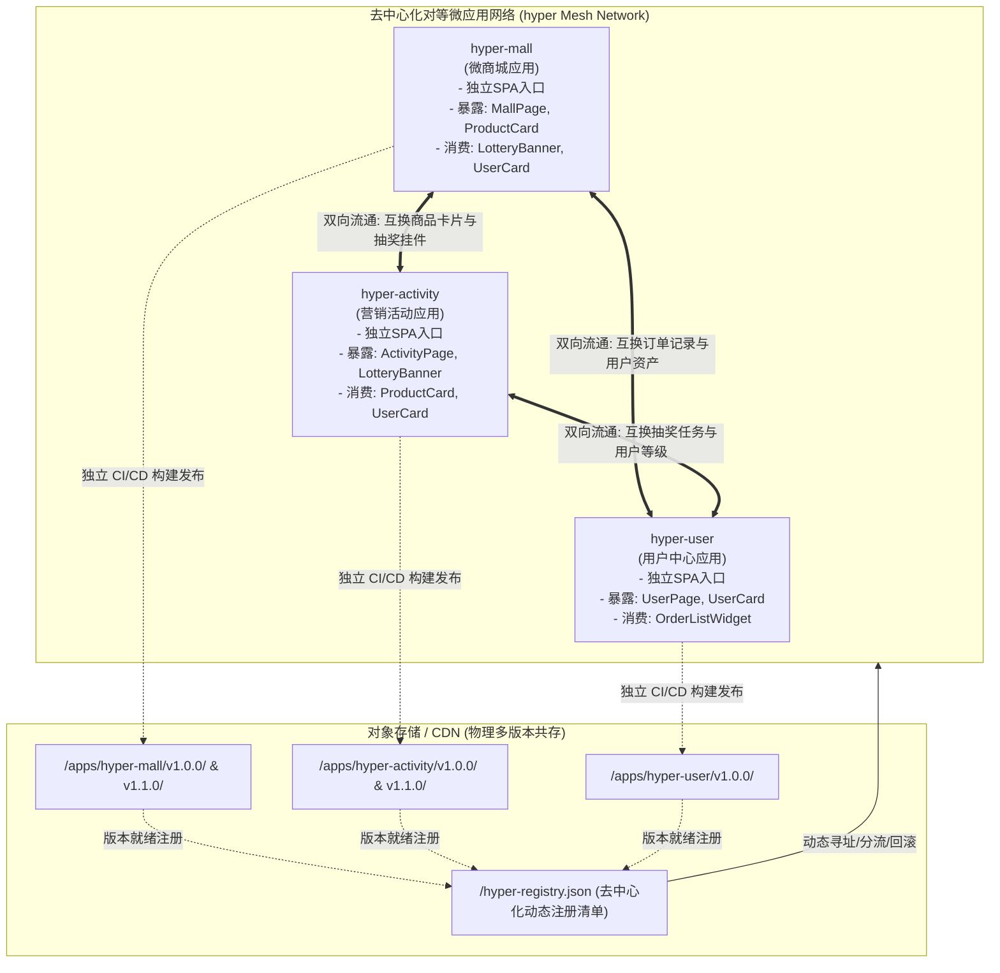
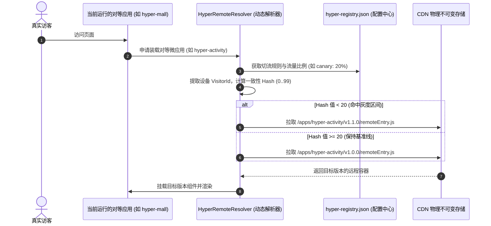

# Vue 3 + Vite + Module Federation 2.0 去中心化微前端架构实战指南
## —— 纯对等网状架构 (Peer-to-Peer Mesh)、独立仓库、独立部署、多版本管理、秒级回滚、灰度发布与 A/B 测试全链路落地方案

---

## 目录

- [第一章 去中心化架构哲学与拓扑设计](#第一章-去中心化架构哲学与拓扑设计)
  - [1.1 摒弃传统“单主应用/中心基座”：走向对等网状 (Peer-to-Peer Mesh)](#11-摒弃传统单主应用中心基座走向对等网状-peer-to-peer-mesh)
  - [1.2 去中心化网状拓扑图 (Decentralized Mesh Topology)](#12-去中心化网状拓扑图-decentralized-mesh-topology)
  - [1.3 去中心化核心特性与业务收益](#13-去中心化核心特性与业务收益)
- [第二章 独立仓库 (Polyrepo) 与对等工程规范](#第二章-独立仓库-polyrepo-与对等工程规范)
  - [2.1 物理仓库划分与 hyper 命名空间规范](#21-物理仓库划分与-hyper-命名空间规范)
  - [2.2 去中心化依赖协商与 SemVer 基线控制](#22-去中心化依赖协商与-semver-基线控制)
  - [2.3 跨微应用 TypeScript 契约声明](#23-跨微应用-typescript-契约声明)
- [第三章 Vite + Module Federation 2.0 双向联邦配置 (Bi-directional)](#第三章-vite--module-federation-20-双向联邦配置-bi-directional)
  - [3.1 对等微应用 A (`hyper-mall`)：既是提供方又是消费方](#31-对等微应用-a-hyper-mall既是提供方又是消费方)
  - [3.2 对等微应用 B (`hyper-activity`)：营销活动组件双向流通](#32-对等微应用-b-hyper-activity营销活动组件双向流通)
  - [3.3 去中心化 ShareScope 自动初始化与单例协商机制](#33-去中心化-sharescope-自动初始化与单例协商机制)
- [第四章 独立 CI/CD 构建与 CDN 物理多版本共存体系](#第四章-独立-cicd-构建与-cdn-物理多版本共存体系)
  - [4.1 物理多版本路径规约 (不可变资产存储)](#41-物理多版本路径规约-不可变资产存储)
  - [4.2 对等应用独立 CI/CD 流水线 (GitHub Actions 示例)](#42-对等应用独立-cicd-流水线-github-actions-示例)
  - [4.3 去中心化元数据清单契约 (`hyper-registry.json`)](#43-去中心化元数据清单契约-hyper-registryjson)
- [第五章 运行时去中心化动态 Remote 解析引擎](#第五章-运行时去中心化动态-remote-解析引擎)
  - [5.1 运行时动态寻址原理与去中心化加载器](#51-运行时动态寻址原理与去中心化加载器)
  - [5.2 核心解析器代码实现 (`HyperRemoteResolver.ts`)](#52-核心解析器代码实现-hyperremoteresolverts)
  - [5.3 跨应用安全沙盒与单例注入实现](#53-跨应用安全沙盒与单例注入实现)
- [第六章 灰度发布、多维识别与渐进式切流 (Traffic Switching)](#第六章-灰度发布多维识别与渐进式切流-traffic-switching)
  - [6.1 白名单（内测工号/UID/Cookie）灰度策略](#61-白名单内测工号uidcookie灰度策略)
  - [6.2 渐进式权重切流 (Canary Rollout) 流程设计](#62-渐进式权重切流-canary-rollout-流程设计)
  - [6.3 边缘网关 (Nginx / OpenResty) 去中心化切流配置](#63-边缘网关-nginx--openresty-去中心化切流配置)
- [第七章 A/B 测试系统与确定性分流算法](#第七章-ab-测试系统与确定性分流算法)
  - [7.1 微应用级 A/B 痛点：杜绝跨应用跳变闪烁与状态撕裂](#71-微应用级-ab-痛点杜绝跨应用跳变闪烁与状态撕裂)
  - [7.2 确定性一致性 Hash 离散分桶算法实现](#72-确定性一致性-hash-离散分桶算法实现)
  - [7.3 URL 强制调测通道与曝光埋点全链路闭环](#73-url-强制调测通道与曝光埋点全链路闭环)
- [第八章 零重构建的秒级极速回滚机制 (Instant Rollback)](#第八章-零重构建的秒级极速回滚机制-instant-rollback)
  - [8.1 去中心化“指针回滚”哲学：各业务线互不阻塞](#81-去中心化指针回滚哲学各业务线互不阻塞)
  - [8.2 自动化秒级回滚 CLI 工具实现](#82-自动化秒级回滚-cli-工具实现)
  - [8.3 异常自动熔断降级 (Circuit Breaker)](#83-异常自动熔断降级-circuit-breaker)
- [第九章 对等组件无缝挂载与分布式状态总线](#第九章-对等组件无缝挂载与分布式状态总线)
  - [9.1 异步动态组件包装器 (`HyperAsyncWidget.vue`)](#91-异步动态组件包装器-hyperasyncwidgetvue)
  - [9.2 去中心化分布式事件总线 (`hyperEventBus.ts`)](#92-去中心化分布式事件总线-hypereventbusts)
- [第十章 生产环境网络部署与缓存规约](#第十章-生产环境网络部署与缓存规约)
  - [10.1 单域名统一反向代理架构 (Zero CORS)](#101-单域名统一反向代理架构-zero-cors)
  - [10.2 极致缓存控制 (Cache-Control) 矩阵](#102-极致缓存控制-cache-control-矩阵)
  - [10.3 生产落地 Checklist](#103-生产落地-checklist)

---

## 第一章 去中心化架构哲学与拓扑设计

### 1.1 摒弃传统“单主应用/中心基座”：走向对等网状 (Peer-to-Peer Mesh)

在传统的微前端方案（如 qiankun、早期 single-spa、wujie）中，通常必须依赖一个**中心化的“主应用 (Host / Shell / Base App)”**。这种星型架构存在严重的结构性缺陷：
- **单点故障 (Single Point of Failure)**：主应用一旦故障，所有子应用全军覆没；
- **发版依赖瓶颈**：子应用想要发布一个全局配置或升级路由，往往需要主应用团队排期协调与重新发版；
- **无法自包含运行**：子应用无法独立脱离基座运行，本地调试需借用基座代理，开发体验割裂；
- **组件不能自由平级流动**：子应用 A 想使用子应用 B 的一个小卡片，通常需要主应用做中转，导致链路冗长。

**Module Federation 2.0 去中心化架构的本质**：
- **没有任何一个应用是绝对的“中心主应用”**，每个应用都是**平等的对等微应用 (Peer App)**；
- 每个对等微应用既是**资源提供方 (Provider / Remote)**，也是**资源消费方 (Consumer / Host)**——即 **双向联邦 (Bi-directional Federation)**；
- 任意应用都可以**独立作为 SPA 入口对外提供服务**，也可以**作为微模块被其他对等应用在任意层级无缝引用**；
- 共享依赖（Vue、Pinia、路由等）通过浏览器运行时的共享作用域由**最先加载的对等节点自动初始化**，后加载的节点自动检测并复用。

### 1.2 去中心化网状拓扑图 (Decentralized Mesh Topology)



### 1.3 去中心化核心特性与业务收益

1. **对等自治 (Peer Autonomy)**：`hyper-mall`、`hyper-activity`、`hyper-user` 各自独立建仓、独立排期、独立测试、独立发布，**发版无需任何跨团队协同确认**；
2. **就地集成 (In-situ Composition)**：商城页面内可以直接嵌入活动轮盘，活动页面内可以直接嵌入商城商品卡片，无需全局基座做中转；
3. **零沙箱开销，原生 ESM 性能**：去除繁重的 JS Proxy 拦截沙箱，依靠打包规范与作用域隔离，性能直达浏览器原生水准。

---

## 第二章 独立仓库 (Polyrepo) 与对等工程规范

### 2.1 物理仓库划分与 hyper 命名空间规范

系统由完全物理隔离的独立 Git 仓库组成，所有微应用均统一在 `hyper` 命名空间下：

```
├── 仓库 1: git@github.com:hyper/hyper-mall.git (微商城对等应用)
│   ├── src/
│   │   ├── components/       # 内部组件 & 待暴露组件 (ProductCard.vue)
│   │   ├── views/            # 商城完整页面 (MallPage.vue)
│   │   ├── utils/            # 动态加载器与工具
│   │   └── App.vue           # 独立 SPA 运行根组件
│   └── vite.config.ts        # 模块联邦双向配置
│
├── 仓库 2: git@github.com:hyper/hyper-activity.git (营销活动对等应用)
│   ├── src/
│   │   ├── components/       # 营销组件 (LotteryBanner.vue)
│   │   ├── views/            # 抽奖主页 (ActivityPage.vue)
│   │   └── App.vue
│   └── vite.config.ts
│
└── 仓库 3: git@github.com:hyper/hyper-user.git (用户中心对等应用)
    ├── src/
    │   ├── components/       # 用户卡片 (UserCard.vue)
    │   └── views/            # 个人中心 (UserPage.vue)
    └── vite.config.ts
```

### 2.2 去中心化依赖协商与 SemVer 基线控制

由于没有“中心主应用”强制注入公共库，各个独立仓库的 `package.json` 共同约定**核心运行时基线（SemVer 兼容）**。当微应用 A 遇到微应用 B 时，模块联邦运行时会在内存中自动协商，选择 SemVer 范围内的最高兼容单例：

```json
// 各个 hyper 对等应用的 package.json 统一遵循的基础规范
{
  "name": "@hyper/mall",
  "version": "1.1.0",
  "dependencies": {
    "vue": "^3.5.0",
    "vue-router": "^4.4.0",
    "pinia": "^2.2.0"
  },
  "devDependencies": {
    "@module-federation/vite": "^1.2.0",
    "@vitejs/plugin-vue": "^5.1.0",
    "vite": "^5.4.0 || ^6.0.0"
  }
}
```

### 2.3 跨微应用 TypeScript 契约声明

通过 `@hyper/types` 轻量契约包或本地类型声明，实现跨仓库调用时的强类型感知与 IDE 自动补全：

```typescript
// 在 hyper-mall/src/types/remotes.d.ts 中声明所消费的对等端组件契约
declare module 'hyperActivity/LotteryBanner' {
  import { DefineComponent } from 'vue';
  const component: DefineComponent<{
    campaignId: string;
    onPrizeWon?: (prize: { id: string; name: string }) => void;
  }>;
  export default component;
}

declare module 'hyperUser/UserCard' {
  import { DefineComponent } from 'vue';
  const component: DefineComponent<{
    userId?: string;
    showPointsBadge?: boolean;
  }>;
  export default component;
}
```

---

## 第三章 Vite + Module Federation 2.0 双向联邦配置 (Bi-directional)

### 3.1 对等微应用 A (`hyper-mall`)：既是提供方又是消费方

`hyper-mall` 在暴露自身业务模块的同时，又动态引用了 `hyper-activity` 的活动挂件和 `hyper-user` 的用户信息卡片：

```typescript
// hyper-mall/vite.config.ts
import { defineConfig } from 'vite';
import vue from '@vitejs/plugin-vue';
import { federation } from '@module-federation/vite';

export default defineConfig(({ command }) => {
  const isProd = command === 'build';
  const appVersion = process.env.VITE_APP_VERSION || 'v1.1.0';
  const publicBase = process.env.VITE_APP_BASE || (isProd ? `/apps/hyper-mall/${appVersion}/` : '/');

  return {
    base: publicBase,
    define: {
      __HYPER_APP_VERSION__: JSON.stringify(appVersion),
    },
    server: {
      port: 3001,
      cors: true,
      origin: 'http://localhost:3001',
    },
    plugins: [
      vue(),
      federation({
        name: 'hyperMall',
        filename: 'remoteEntry.js',
        manifest: true,
        // 1. 作为提供方：暴露整页和原子挂件
        exposes: {
          './MallPage': './src/views/MallPage.vue',
          './ProductCard': './src/components/ProductCard.vue',
        },
        // 2. 作为消费方：消费对等微应用的组件 (开发环境直连本地，生产环境运行时动态覆盖)
        remotes: {
          hyperActivity: {
            type: 'module',
            name: 'hyperActivity',
            entry: isProd ? '/apps/hyper-activity/remoteEntry.js' : 'http://localhost:3002/remoteEntry.js',
            entryGlobalName: 'hyperActivity',
            shareScope: 'default',
          },
          hyperUser: {
            type: 'module',
            name: 'hyperUser',
            entry: isProd ? '/apps/hyper-user/remoteEntry.js' : 'http://localhost:3003/remoteEntry.js',
            entryGlobalName: 'hyperUser',
            shareScope: 'default',
          },
        },
        // 3. 去中心化单例共享：谁先入场谁初始化，后续对等应用全部自动复用
        shared: {
          vue: {
            singleton: true,
            requiredVersion: '^3.5.0',
          },
          'vue-router': {
            singleton: true,
            requiredVersion: '^4.4.0',
          },
          pinia: {
            singleton: true,
            requiredVersion: '^2.2.0',
          },
        },
      }),
    ],
    build: {
      target: 'chrome89', // 拥抱原生 ESM 及 top-level await
    },
  };
});
```

### 3.2 对等微应用 B (`hyper-activity`)：营销活动组件双向流通

`hyper-activity` 独立运行为抽奖系统，同时又暴露组件给商城使用，并反向嵌入商城的精选商品：

```typescript
// hyper-activity/vite.config.ts
import { defineConfig } from 'vite';
import vue from '@vitejs/plugin-vue';
import { federation } from '@module-federation/vite';

export default defineConfig(({ command }) => {
  const isProd = command === 'build';
  const appVersion = process.env.VITE_APP_VERSION || 'v1.1.0';
  const publicBase = process.env.VITE_APP_BASE || (isProd ? `/apps/hyper-activity/${appVersion}/` : '/');

  return {
    base: publicBase,
    define: {
      __HYPER_APP_VERSION__: JSON.stringify(appVersion),
    },
    server: {
      port: 3002,
      cors: true,
      origin: 'http://localhost:3002',
    },
    plugins: [
      vue(),
      federation({
        name: 'hyperActivity',
        filename: 'remoteEntry.js',
        manifest: true,
        exposes: {
          './ActivityPage': './src/views/ActivityPage.vue',
          './LotteryBanner': './src/components/LotteryBanner.vue',
        },
        remotes: {
          hyperMall: {
            type: 'module',
            name: 'hyperMall',
            entry: isProd ? '/apps/hyper-mall/remoteEntry.js' : 'http://localhost:3001/remoteEntry.js',
            entryGlobalName: 'hyperMall',
            shareScope: 'default',
          },
        },
        shared: {
          vue: { singleton: true, requiredVersion: '^3.5.0' },
          'vue-router': { singleton: true, requiredVersion: '^4.4.0' },
          pinia: { singleton: true, requiredVersion: '^2.2.0' },
        },
      }),
    ],
    build: {
      target: 'chrome89',
    },
  };
});
```

### 3.3 去中心化 ShareScope 自动初始化与单例协商机制

在没有中心基座的场景下，模块联邦如何确保全局只有一个 Vue 单例？

```
[用户首先访问 /activity 页面]
  1. hyper-activity 优先加载并执行。
  2. 运行时发现 window.__FEDERATION__.__INSTANCES__ 为空。
  3. hyper-activity 自动担当“首发初始化节点”，将自身绑定的 Vue 3.5 注册进全局 default shareScope。
  4. 随后，页面异步引入 hyper-mall 的 ProductCard 组件。
  5. hyper-mall 的 remoteEntry.js 执行 container.init(shareScope)。
  6. 检测到 shareScope 中已有满足 ^3.5.0 的 Vue 单例，直接复用已有实例，不额外下载，不产生双重上下文！
```

---

## 第四章 独立 CI/CD 构建与 CDN 物理多版本共存体系

### 4.1 物理多版本路径规约 (不可变资产存储)

为彻底解决微前端发版时的静态资源缓存覆盖、用户正在浏览时拉取旧 Chunk 404 等顽疾，所有微应用均推送到 CDN 独立的多版本目录中：

```
https://cdn.hyper.io/
  ├── apps/
  │   ├── hyper-mall/
  │   │   ├── v1.0.0/                      # 稳定基线版本 (物理不可变文件)
  │   │   │   ├── remoteEntry.js
  │   │   │   └── assets/
  │   │   │       ├── index.28f9a1.js
  │   │   │       └── style.e4c19b.css
  │   │   └── v1.1.0/                      # 灰度新版本 / A/B 实验组版本
  │   │       ├── remoteEntry.js
  │   │       └── assets/
  │   ├── hyper-activity/
  │   │   ├── v1.0.0/
  │   │   └── v1.1.0/
  │   └── hyper-user/
  │       └── v1.0.0/
  └── hyper-registry.json                  # 全局去中心化元数据编排清单
```

### 4.2 对等应用独立 CI/CD 流水线 (GitHub Actions 示例)

任何一个微应用发生 Commit 或打 Tag 时，只构建并发布自身，**0 影响其他对等应用**：

```yaml
# .github/workflows/deploy-hyper-mall.yml
name: Deploy hyper-mall (Peer App Isolated Pipeline)

on:
  push:
    tags:
      - 'v*'
  workflow_dispatch:
    inputs:
      target_version:
        description: '发布版本号 (如 v1.1.0)'
        required: true
        default: 'v1.1.0'

jobs:
  build-and-ship:
    runs-on: ubuntu-latest
    steps:
      - name: Checkout Code
        uses: actions/checkout@v4

      - name: Setup Node.js & pnpm
        uses: pnpm/action-setup@v3
        with:
          version: 9
      - uses: actions/setup-node@v4
        with:
          node-version: 20
          cache: 'pnpm'

      - name: Resolve Version
        run: |
          if [ "${{ github.event_name }}" = "workflow_dispatch" ]; then
            echo "VER=${{ github.event.inputs.target_version }}" >> $GITHUB_ENV
          else
            echo "VER=${GITHUB_REF_NAME}" >> $GITHUB_ENV
          fi

      - name: Install Dependencies
        run: pnpm install --frozen-lockfile

      - name: Build with Injected Base Path
        env:
          VITE_APP_VERSION: ${{ env.VER }}
          VITE_APP_BASE: /apps/hyper-mall/${{ env.VER }}/
        run: |
          pnpm run build

      - name: Deploy to Cloudflare / S3 / OSS Versioned Path
        uses: jakejarvis/s3-sync-action@master
        with:
          args: --acl public-read --follow-symlinks
        env:
          AWS_S3_BUCKET: ${{ secrets.HYPER_CDN_BUCKET }}
          AWS_ACCESS_KEY_ID: ${{ secrets.HYPER_KEY_ID }}
          AWS_SECRET_ACCESS_KEY: ${{ secrets.HYPER_SECRET_KEY }}
          SOURCE_DIR: './dist'
          DEST_DIR: 'apps/hyper-mall/${{ env.VER }}'

      - name: Publish Version Registration Event
        run: |
          curl -X POST "https://api.hyper.io/registry/register" \
            -H "Authorization: Bearer ${{ secrets.HYPER_REGISTRY_TOKEN }}" \
            -H "Content-Type: application/json" \
            -d '{
              "appId": "hyperMall",
              "version": "${{ env.VER }}",
              "entry": "/apps/hyper-mall/${{ env.VER }}/remoteEntry.js",
              "moduleName": "hyperMall",
              "exposePath": "./MallPage",
              "commit": "${{ github.sha }}"
            }'
```

### 4.3 去中心化元数据清单契约 (`hyper-registry.json`)

清单文件定义了每个独立对等应用的当前生产激活版本、历史版本元数据、灰度白名单与 A/B 实验规则：

```json
{
  "name": "hyper-decentralized-registry",
  "version": "1.0.0",
  "updatedAt": "2026-10-01T08:00:00.000Z",
  "activeVersions": {
    "hyperMall": "v1.1.0",
    "hyperActivity": "v1.1.0",
    "hyperUser": "v1.0.0"
  },
  "apps": {
    "hyperMall": {
      "id": "hyperMall",
      "name": "微商城对等应用",
      "moduleName": "hyperMall",
      "exposePath": "./MallPage",
      "devEntry": "http://localhost:3001/remoteEntry.js",
      "versions": {
        "v1.0.0": {
          "version": "v1.0.0",
          "entry": "/apps/hyper-mall/v1.0.0/remoteEntry.js",
          "releasedAt": "2026-09-20 10:00:00",
          "tag": "生产稳定版",
          "description": "标准货架、经典商品瀑布流"
        },
        "v1.1.0": {
          "version": "v1.1.0",
          "entry": "/apps/hyper-mall/v1.1.0/remoteEntry.js",
          "releasedAt": "2026-10-01 08:00:00",
          "tag": "最新线上版",
          "description": "限时特惠秒杀横幅、动态大促角标"
        }
      }
    },
    "hyperActivity": {
      "id": "hyperActivity",
      "name": "营销活动对等应用",
      "moduleName": "hyperActivity",
      "exposePath": "./ActivityPage",
      "devEntry": "http://localhost:3002/remoteEntry.js",
      "versions": {
        "v1.0.0": {
          "version": "v1.0.0",
          "entry": "/apps/hyper-activity/v1.0.0/remoteEntry.js",
          "tag": "生产稳定版"
        },
        "v1.1.0": {
          "version": "v1.1.0",
          "entry": "/apps/hyper-activity/v1.1.0/remoteEntry.js",
          "tag": "最新线上版"
        }
      }
    }
  },
  "canary": {
    "hyperMall": {
      "enabled": true,
      "canaryVersion": "v1.1.0",
      "baselineVersion": "v1.0.0",
      "whitelistUsers": ["hyper_user_001", "qa_tester_99"],
      "trafficRatio": 30
    }
  },
  "experiments": {
    "hyperMall": {
      "id": "exp_hyper_mall_conversion_2026",
      "name": "微商城 8折特惠版 vs 经典版 A/B 转化率实验",
      "enabled": true,
      "metric": "加购率 & 客单价",
      "buckets": [
        { "group": "A", "name": "对照组 A (经典版)", "version": "v1.0.0", "weight": 50 },
        { "group": "B", "name": "实验组 B (大促版)", "version": "v1.1.0", "weight": 50 }
      ]
    }
  }
}
```

---

## 第五章 运行时去中心化动态 Remote 解析引擎

### 5.1 运行时动态寻址原理与去中心化加载器

在对等网状架构中，任意应用在消费其他对等端时，绝不能将 URL 静态写死在打包配置中。

每一个对等微应用内部均内置轻量的 `HyperRemoteResolver` 模块，其核心职责为：
1. **去中心化配置拉取**：从 CDN 或注册服务拉取最新 `hyper-registry.json`；
2. **多维规则决策**：综合白名单、URL 强制调试参数、A/B 实验分流算法，决策出目标应用的版本号；
3. **动态拉取并注入单例**：动态 `import()` 加载对等端的 `remoteEntry.js`，自动注入运行时的 `shareScope`；
4. **获取组件实例**：执行 `container.get(exposePath)` 并返回 Vue 组件。

### 5.2 核心解析器代码实现 (`HyperRemoteResolver.ts`)

```typescript
// packages/hyper-core/src/HyperRemoteResolver.ts
import { ref } from 'vue';

export interface AppVersionMeta {
  version: string;
  entry: string;
  tag?: string;
}

export interface PeerAppConfig {
  id: string;
  name: string;
  moduleName: string;
  exposePath: string;
  devEntry: string;
  versions: Record<string, AppVersionMeta>;
}

export interface RegistryManifest {
  activeVersions: Record<string, string>;
  apps: Record<string, PeerAppConfig>;
  canary?: Record<string, any>;
  experiments?: Record<string, any>;
}

class HyperRemoteResolver {
  private registry = ref<RegistryManifest | null>(null);
  private containerCache = new Map<string, any>();
  private currentVisitorId = '';

  constructor() {
    this.initVisitorIdentity();
  }

  // 1. 初始化持久化设备/访客标识
  private initVisitorIdentity() {
    if (typeof window === 'undefined') return;
    const STORAGE_KEY = '__HYPER_VISITOR_ID__';
    let vid = localStorage.getItem(STORAGE_KEY);
    if (!vid) {
      vid = `hyper_v_${Date.now().toString(36)}_${Math.random().toString(36).slice(2, 8)}`;
      localStorage.setItem(STORAGE_KEY, vid);
    }
    this.currentVisitorId = vid;
  }

  public getVisitorId(): string {
    return this.currentVisitorId;
  }

  // 2. 拉取去中心化注册清单
  public async fetchRegistry(): Promise<RegistryManifest> {
    if (this.registry.value) return this.registry.value;
    try {
      const res = await fetch(`/hyper-registry.json?_t=${Date.now()}`);
      if (res.ok) {
        this.registry.value = await res.json();
      }
    } catch (e) {
      console.warn('[HyperRemoteResolver] 无法获取网络清单，启用本地兜底配置', e);
    }
    return this.registry.value || { activeVersions: {}, apps: {} };
  }

  // 3. 确定性 Hash 计算：计算 0..99 的分流数值
  private computeConsistentHash(seed: string): number {
    let hash = 0;
    for (let i = 0; i < seed.length; i++) {
      hash = (hash << 5) - hash + seed.charCodeAt(i);
      hash |= 0;
    }
    return Math.abs(hash) % 100;
  }

  // 4. 计算当前对等端应该使用的目标版本 (优先级: URL调试参 > 白名单 > A/B实验 > 全网默认)
  public async resolveTargetVersion(appId: string): Promise<string> {
    const reg = await this.fetchRegistry();
    const appConfig = reg.apps[appId];
    if (!appConfig) {
      throw new Error(`[HyperRemoteResolver] 未注册的对等应用: ${appId}`);
    }

    // A. 检查 URL 是否带强制覆盖参 (例如 ?hyperMall_ver=v1.0.0 或 ?hyperMall_ab=B)
    if (typeof window !== 'undefined') {
      const params = new URLSearchParams(window.location.search);
      const forcedVer = params.get(`${appId}_ver`);
      if (forcedVer && appConfig.versions[forcedVer]) {
        return forcedVer;
      }
    }

    // B. 检查白名单与灰度切流 (Canary)
    const canary = reg.canary?.[appId];
    if (canary && canary.enabled) {
      // 1) 优先判断 UID / 设备白名单
      if (canary.whitelistUsers?.includes(this.currentVisitorId)) {
        return canary.canaryVersion;
      }
      // 2) 判定灰度流量比例
      const hashScore = this.computeConsistentHash(`${this.currentVisitorId}:${appId}:canary`);
      if (hashScore < canary.trafficRatio) {
        return canary.canaryVersion;
      }
    }

    // C. 检查 A/B 实验分桶
    const exp = reg.experiments?.[appId];
    if (exp && exp.enabled && exp.buckets?.length) {
      const score = this.computeConsistentHash(`${this.currentVisitorId}:${exp.id}`);
      let cumulative = 0;
      for (const bucket of exp.buckets) {
        cumulative += bucket.weight;
        if (score < cumulative) {
          return bucket.version;
        }
      }
    }

    // D. 全局激活的默认版本
    return reg.activeVersions[appId] || Object.keys(appConfig.versions)[0];
  }

  // 5. 核心：加载目标对等端组件
  public async loadPeerModule<T = any>(appId: string, customExposePath?: string): Promise<T> {
    const reg = await this.fetchRegistry();
    const appConfig = reg.apps[appId];
    if (!appConfig) {
      throw new Error(`[HyperRemoteResolver] 未知微应用: ${appId}`);
    }

    const version = await this.resolveTargetVersion(appId);
    const verMeta = appConfig.versions[version];
    const isProd = typeof window !== 'undefined' && location.hostname !== 'localhost';

    // 生产环境使用带版本号的 CDN 地址，开发环境直连本地 devEntry
    const rawUrl = isProd ? (verMeta ? verMeta.entry : appConfig.devEntry) : appConfig.devEntry;
    const finalUrl = `${rawUrl}?v=${encodeURIComponent(version)}`;

    console.log(`[HyperRemoteResolver] 🔗 正在动态解析对等模块 [${appConfig.name}] -> 版本: ${version} 地址: ${finalUrl}`);

    // A. 从缓存获取或动态导入 remoteEntry.js
    let container = this.containerCache.get(finalUrl);
    if (!container) {
      container = await import(/* @vite-ignore */ finalUrl);
      this.containerCache.set(finalUrl, container);
    }

    // B. 获取共享作用域 (ShareScope)
    // 兼容 Module Federation 2.0 规范，优先获取已有作用域，没有则初始化空对象
    const fedGlobal = (window as any).__FEDERATION__;
    const instances = fedGlobal?.__INSTANCES__ || [];
    const firstInstance = instances[0];
    const shareScope = firstInstance?.shareScopeMap?.default || {};

    // C. 容器依赖初始化
    if (typeof container.init === 'function') {
      try {
        await container.init(shareScope);
      } catch (err) {
        // 如果该作用域已初始化过，静默忽略
      }
    }

    // D. 提取暴露的组件/方法
    const targetExpose = customExposePath || appConfig.exposePath;
    const factory = await container.get(targetExpose);
    const exportsObj = typeof factory === 'function' ? factory() : factory;
    return (exportsObj?.default || exportsObj) as T;
  }
}

export const hyperRemoteResolver = new HyperRemoteResolver();
```

---

## 第六章 灰度发布、多维识别与渐进式切流 (Traffic Switching)

### 6.1 白名单（内测工号/UID/Cookie）灰度策略

在对等网状架构中，灰度环境支持**业务微应用自主决策**：
- `hyper-mall` 发布了一个全场 8 折大促版本（`v1.1.0`）；
- 在 `hyper-registry.json` 中配置仅对 `whitelistUsers` 白名单用户生效；
- 无论是从 `hyper-mall` 本身页面进入，还是从 `hyper-activity` 的抽奖页跳转，只要是白名单用户，均统一看到 `v1.1.0` 界面。

### 6.2 渐进式权重切流 (Canary Rollout) 流程设计



### 6.3 边缘网关 (Nginx / OpenResty) 去中心化切流配置

除客户端运行时分流外，企业边缘网关（Nginx 或 Cloudflare Workers）可直接基于 Header 或 Cookie 在静态请求层面实现切流：

```nginx
# /etc/nginx/conf.d/hyper_mesh_gateway.conf

# 1. 识别白名单内测 Header 或 Cookie
map $http_x_hyper_canary $is_hyper_tester {
    default 0;
    "true"  1;
}

# 2. 针对普通访客，按客户端 IP 计算切流权重
split_clients "${remote_addr}${http_user_agent}" $mall_canary_bucket {
    20%     "canary";   # 20% 流量命中新版
    *       "stable";   # 80% 流量保持旧版
}

server {
    listen 80;
    server_name mfe.hyper.io;

    root /var/www/hyper;

    # 任何对等应用入口 HTML 强校验缓存
    location ~ ^/(mall|activity|user) {
        try_files $uri $uri/ /index.html;
        add_header Cache-Control "no-cache, no-store, must-revalidate";
    }

    # hyper-mall 的 remoteEntry.js 边缘网关分流
    location = /apps/hyper-mall/remoteEntry.js {
        add_header Cache-Control "no-cache";

        # 优先保障内测员工白名单
        if ($is_hyper_tester = 1) {
            rewrite ^ /apps/hyper-mall/v1.1.0/remoteEntry.js break;
        }

        # 渐进式按比例切流
        if ($mall_canary_bucket = "canary") {
            rewrite ^ /apps/hyper-mall/v1.1.0/remoteEntry.js break;
        }

        # 默认回退基线稳定版
        rewrite ^ /apps/hyper-mall/v1.0.0/remoteEntry.js break;
    }

    # 包含哈希的 JS/CSS 开启 1 年不可变长缓存
    location ~* \.(?:js|css|woff2?|png|jpg|svg)$ {
        expires 1y;
        add_header Cache-Control "public, max-age=31536000, immutable";
    }
}
```

---

## 第七章 A/B 测试系统与确定性分流算法

### 7.1 微应用级 A/B 痛点：杜绝跨应用跳变闪烁与状态撕裂

在模块联邦网状对等结构中，如果每次渲染随机分流，会导致灾难性体验：
- 访客在商城首页刷新，商品卡片是新版（圆角+抢购价）；
- 点进详情页再返回，商品卡片变成了旧版（直角+原价）；
- 跨微应用数据统计混乱，购物车内的商品版本与结算组件版本逻辑冲突。

**解决方案**：
采用 **确定性一致性 Hash 算法**。以 `VisitorId + ExperimentId` 为唯一种子进行哈希运算。只要访客的设备指纹不变、实验 ID 不变，其计算出来的分流组别（A 组或 B 组）**在宇宙中是数学恒定的**，彻底消灭任何版本跳变闪烁！

### 7.2 确定性一致性 Hash 离散分桶算法实现

```typescript
// packages/hyper-core/src/HyperABTesting.ts

export interface ABBucket {
  group: 'A' | 'B' | string;
  name: string;
  version: string;
  weight: number; // 0..100
}

export interface ABExperiment {
  id: string;
  name: string;
  enabled: boolean;
  metric: string;
  buckets: ABBucket[];
}

export interface ABEvaluation {
  inExperiment: boolean;
  group: string;
  version: string;
  score: number;
  visitorId: string;
  isForced: boolean;
}

export class HyperABTesting {
  /**
   * 32 位 Murmur-like 字符串快速散列算法
   */
  public static hash(input: string): number {
    let hash = 0;
    for (let i = 0; i < input.length; i++) {
      hash = (hash << 5) - hash + input.charCodeAt(i);
      hash |= 0;
    }
    return Math.abs(hash);
  }

  /**
   * 评定访客命中的实验组别
   */
  public static evaluate(
    visitorId: string,
    appId: string,
    exp: ABExperiment,
    defaultVersion: string
  ): ABEvaluation {
    if (!exp || !exp.enabled || !exp.buckets?.length) {
      return {
        inExperiment: false,
        group: 'control',
        version: defaultVersion,
        score: 0,
        visitorId,
        isForced: false,
      };
    }

    // 1. 检查是否存在人工锁定参数 (如 ?hyperMall_ab=B)
    if (typeof window !== 'undefined') {
      const search = new URLSearchParams(window.location.search);
      const overrideGroup = search.get(`${appId}_ab`) || search.get(`${appId}_group`);
      if (overrideGroup) {
        const found = exp.buckets.find(b => b.group.toUpperCase() === overrideGroup.toUpperCase());
        if (found) {
          return {
            inExperiment: true,
            group: found.group,
            version: found.version,
            score: -1,
            visitorId,
            isForced: true,
          };
        }
      }
    }

    // 2. 计算确定性分值 (0..99)
    const seed = `${visitorId}:${exp.id}`;
    const score = this.hash(seed) % 100;

    let cursor = 0;
    let selected = exp.buckets[0];
    for (const b of exp.buckets) {
      cursor += b.weight;
      if (score < cursor) {
        selected = b;
        break;
      }
    }

    return {
      inExperiment: true,
      group: selected.group,
      version: selected.version,
      score,
      visitorId,
      isForced: false,
    };
  }
}
```

### 7.3 URL 强制调测通道与曝光埋点全链路闭环

```typescript
// 曝光埋点上报实现
export function trackExperimentExposure(appId: string, evalResult: ABEvaluation) {
  if (!evalResult.inExperiment) return;

  const eventData = {
    event: 'hyper_ab_impression',
    appId,
    visitorId: evalResult.visitorId,
    group: evalResult.group,
    version: evalResult.version,
    score: evalResult.score,
    timestamp: Date.now(),
  };

  // 通过 Navigator Beacon 异步上报，不阻塞页面交互
  if (navigator.sendBeacon) {
    navigator.sendBeacon('/api/analytics/hyper-ab-exposure', JSON.stringify(eventData));
  }

  console.log(
    `%c[hyper A/B 曝光]%c 对等应用: ${appId} -> 命中 [${evalResult.group}组] 版本: ${evalResult.version} (Hash: ${evalResult.score})`,
    'background:#10b981;color:white;padding:2px 6px;border-radius:3px;font-weight:bold;',
    'color:#10b981;font-weight:bold;'
  );
}
```

---

## 第八章 零重构建的秒级极速回滚机制 (Instant Rollback)

### 8.1 去中心化“指针回滚”哲学：各业务线互不阻塞

在传统单体或中心化架构中，一旦线上某个子模块出现致命 Bug（例如商城购物车报错）：
- 必须联系主应用值班人员；
- 提 PR 恢复旧代码；
- 触发漫长的 15 ~ 30 分钟全量 CI/CD 构建；
- 期间如果还有其他团队正在合代码，会导致全员阻塞甚至发版冲突。

**在 hyper 去中心化架构中**：
- 静态资源物理多版本早已并存于 CDN（`v1.0.0` 和 `v1.1.0` 同时在线）；
- 回滚**完全不需要重新编译打包代码**；
- 商城团队只需**将 `hyper-registry.json` 中 `hyperMall` 的指针从 `v1.1.0` 修改为 `v1.0.0`**；
- 3 秒同步至 CDN 边缘节点，全网立刻生效！其他对等应用（`hyper-activity`、`hyper-user`）完全不受任何波及！

### 8.2 自动化秒级回滚 CLI 工具实现

```javascript
// scripts/rollback.mjs
import fs from 'node:fs';
import path from 'node:path';
import { execSync } from 'node:child_process';

const args = process.argv.slice(2);
if (args.length < 2) {
  console.log(`
📖 [hyper 对等应用秒级回滚 CLI]
用法: pnpm run rollback <对等微应用名> <目标历史版本号>

示例:
  pnpm run rollback hyperMall v1.0.0       # 将商城一键回退至 v1.0.0 稳定版
  pnpm run rollback hyperActivity v1.0.0   # 将活动一键回退至 v1.0.0 稳定版
`);
  process.exit(1);
}

const [appName, targetVersion] = args;
const manifestPath = path.resolve('./hyper-registry.json');

if (!fs.existsSync(manifestPath)) {
  console.error(`❌ 未找到注册清单文件: ${manifestPath}`);
  process.exit(1);
}

const manifest = JSON.parse(fs.readFileSync(manifestPath, 'utf-8'));
const appConfig = manifest.apps[appName];

if (!appConfig) {
  console.error(`❌ 未知应用: "${appName}"。有效应用清单: ${Object.keys(manifest.apps).join(', ')}`);
  process.exit(1);
}

if (!appConfig.versions[targetVersion]) {
  console.error(`❌ 版本 "${targetVersion}" 不存在于 ${appConfig.name} 中！`);
  console.error(`   可用版本: ${Object.keys(appConfig.versions).join(', ')}`);
  process.exit(1);
}

const previousVersion = manifest.activeVersions[appName];
console.log(`\n======================================================`);
console.log(`🔄 正在秒级回滚对等微应用: ${appConfig.name} (${appName})`);
console.log(`   ⏮️  当前故障版本: ${previousVersion}`);
console.log(`   ⏭️  切回历史版本: ${targetVersion}`);
console.log(`======================================================\n`);

// 1. 仅修改指针
manifest.activeVersions[appName] = targetVersion;
manifest.updatedAt = new Date().toISOString();

// 2. 写回本地
fs.writeFileSync(manifestPath, JSON.stringify(manifest, null, 2));

// 3. 推送至生产边缘 CDN (仅更新数十字节的 JSON 文件)
console.log(`📡 正在推送最新清单至全球边缘节点 (耗时 < 3 秒)...`);
try {
  // 生产环境可替换为直接上传 OSS/S3 或调用网关配置 API
  // execSync('aws s3 cp ./hyper-registry.json s3://hyper-cdn/hyper-registry.json', { stdio: 'inherit' });
  console.log(`\n🎉 [回滚成功] ${appConfig.name} 已在 3 秒内全网无感回退至 ${targetVersion}！`);
} catch (e) {
  console.error(`❌ 推送失败:`, e);
}
```

### 8.3 异常自动熔断降级 (Circuit Breaker)

为应对极端 CDN 节点故障或网络抖动，动态加载器内部具备**自动熔断降级**机制：

```typescript
// 熔断保护与双重降级包装器
export async function loadWithCircuitBreaker(appId: string, preferredVersion: string) {
  try {
    return await hyperRemoteResolver.loadPeerModule(appId);
  } catch (error) {
    console.error(`[CircuitBreaker] ⚠️ 微应用 ${appId} (版本 ${preferredVersion}) 加载异常，触发自动熔断！`, error);

    // 1. 尝试直接降级至备用稳定版本 v1.0.0
    try {
      console.log(`[CircuitBreaker] 正在尝试降级加载基准稳定版 v1.0.0...`);
      return await hyperRemoteResolver.loadPeerModule(appId, './MallPage');
    } catch (fallbackError) {
      // 2. 终极兜底：提供友好占位，确保当前页面不发生白屏崩溃
      return {
        template: `
          <div style="border: 1px dashed #cbd5e1; border-radius: 8px; padding: 24px; text-align: center; color: #64748b;">
            <p style="font-size: 14px; margin: 0 0 8px 0;">⚡ 该微模块正在自愈中</p>
            <button style="padding: 4px 12px; font-size: 12px; cursor: pointer;" onclick="location.reload()">刷新重试</button>
          </div>
        `,
      };
    }
  }
}
```

---

## 第九章 对等组件无缝挂载与分布式状态总线

### 9.1 异步动态组件包装器 (`HyperAsyncWidget.vue`)

在 Vue 3 中，任意微应用可以通过封装好的异步挂载组件，直接在模板中像使用本地组件一样使用对等端的任何 Expose 模块：

```vue
<!-- packages/hyper-core/src/HyperAsyncWidget.vue -->
<script setup lang="ts">
import { ref, shallowRef, watch, onMounted } from 'vue';
import { hyperRemoteResolver } from './HyperRemoteResolver';

const props = defineProps<{
  appId: string;
  exposePath?: string;
  propsToChild?: Record<string, any>;
}>();

const widgetComponent = shallowRef<any>(null);
const isLoading = ref(true);
const loadError = ref('');

async function mountPeerWidget() {
  isLoading.value = true;
  loadError.value = '';

  try {
    const comp = await hyperRemoteResolver.loadPeerModule(props.appId, props.exposePath);
    widgetComponent.value = comp;
  } catch (err: any) {
    loadError.value = err.message || '对等组件加载失败';
  } finally {
    isLoading.value = false;
  }
}

onMounted(() => {
  mountPeerWidget();
});

watch(() => props.appId, () => {
  mountPeerWidget();
});
</script>

<template>
  <div class="hyper-widget-wrapper">
    <!-- 加载骨架屏 -->
    <div v-if="isLoading" class="widget-skeleton">
      <div class="loading-spinner"></div>
      <span>正在动态装载对等微应用模块...</span>
    </div>

    <!-- 容灾错误展示 -->
    <div v-else-if="loadError" class="widget-error">
      <span>⚠️ 模块加载异常</span>
      <button @click="mountPeerWidget">重试</button>
    </div>

    <!-- 正常渲染对等组件 -->
    <component
      :is="widgetComponent"
      v-else
      v-bind="propsToChild"
    />
  </div>
</template>

<style scoped>
.hyper-widget-wrapper {
  display: block;
  width: 100%;
}
.widget-skeleton {
  display: flex;
  align-items: center;
  gap: 8px;
  padding: 20px;
  color: #94a3b8;
  font-size: 13px;
}
.loading-spinner {
  width: 16px;
  height: 16px;
  border: 2px solid #e2e8f0;
  border-top-color: #0ea5e9;
  border-radius: 50%;
  animation: spin 0.8s linear infinite;
}
@keyframes spin {
  to { transform: rotate(360deg); }
}
</style>
```

### 9.2 去中心化分布式事件总线 (`hyperEventBus.ts`)

为了让相互独立的对等微应用之间能够低耦合、高性能地传递数据（例如商城加购后通知营销活动更新积分任务），采用挂载在全局上下文中的轻量事件总线：

```typescript
// packages/hyper-core/src/hyperEventBus.ts

type EventCallback = (data?: any) => void;

class HyperEventBus {
  private channels = new Map<string, Set<EventCallback>>();

  public on(channel: string, callback: EventCallback): () => void {
    if (!this.channels.has(channel)) {
      this.channels.set(channel, new Set());
    }
    this.channels.get(channel)!.add(callback);
    return () => this.off(channel, callback);
  }

  public off(channel: string, callback: EventCallback) {
    this.channels.get(channel)?.delete(callback);
  }

  public emit(channel: string, data?: any) {
    this.channels.get(channel)?.forEach(cb => {
      try {
        cb(data);
      } catch (err) {
        console.error(`[hyperEventBus] Error in channel "${channel}":`, err);
      }
    });
  }
}

// 确保在任何对等微应用被加载时，均共享同一个全局单例总线
const GLOBAL_KEY = '__HYPER_EVENT_BUS__';
if (typeof window !== 'undefined' && !(window as any)[GLOBAL_KEY]) {
  (window as any)[GLOBAL_KEY] = new HyperEventBus();
}

export const hyperEventBus: HyperEventBus =
  typeof window !== 'undefined' ? (window as any)[GLOBAL_KEY] : new HyperEventBus();
```

---

## 第十章 生产环境网络部署与缓存规约

### 10.1 单域名统一反向代理架构 (Zero CORS)

在去中心化生产环境中，强烈建议通过边缘网关将各个独立的微应用静态存储映射在**同一个主域名下**：

```
统一入口域名：https://mfe.hyper.io
  ├── /apps/hyper-mall/      -> 反向代理至 商城 S3/OSS 存储桶
  ├── /apps/hyper-activity/  -> 反向代理至 活动 S3/OSS 存储桶
  ├── /apps/hyper-user/      -> 反向代理至 用户 S3/OSS 存储桶
  └── /hyper-registry.json   -> 反向代理至 注册中心清单
```

**架构收益**：
1. **彻底消除跨域 (Zero CORS)**：所有脚本同源加载，无需在 CDN 配置繁琐的跨域响应头；
2. **统一 Cookie 上下文**：用户鉴权 Token 统一携带，完全免疫跨站 Cookie 策略封禁。

### 10.2 极致缓存控制 (Cache-Control) 矩阵

| 资源分类 | 物理路径规范 | 建议 HTTP 响应头 | 核心设计考量 |
| :--- | :--- | :--- | :--- |
| **注册中心清单** | `/hyper-registry.json` | `no-cache, must-revalidate` | 保证回滚与切流能在 3 秒内全网感知，绝不能长缓存 |
| **对等入口脚本** | `/apps/*/*/remoteEntry.js` | `no-cache, must-revalidate` | 确保灰度指针切换后，浏览器能立即发起 If-Modified 协商 |
| **带哈希静态 Chunk** | `/apps/*/*/assets/*.js` | `public, max-age=31536000, immutable` | 物理不可变资源，强缓存 1 年，极致首屏加速并削减 CDN 带宽 |

### 10.3 生产落地 Checklist

- [ ] **去中心化双向测试**：验证 `hyper-mall` 在无其它应用存在时能否独立启动并在浏览器中正常渲染。
- [ ] **物理版本隔离审计**：确认各仓库 CI 脚本编译输出的 base 路径带有精确版本号（如 `/apps/hyper-mall/v1.1.0/`），杜绝直接覆盖旧版本文件。
- [ ] **Vue 单例检查**：在浏览器 F12 控制台中输入 `window.__FEDERATION__.__INSTANCES__[0].shareScopeMap.default`，确认 `vue` 和 `pinia` 仅存在唯一的 `singleton` 实例。
- [ ] **确定性 Hash 验证**：在控制台中多次调用 `HyperABTesting.evaluate`，确认对于相同访客 ID，无论调用多少次均稳定返回相同的实验版本。
- [ ] **秒级回滚演练**：运行 `pnpm run rollback hyperMall v1.0.0`，验证在不重新构建产物的前提下，刷新页面能否在 3 秒内即时回退到稳定版。
